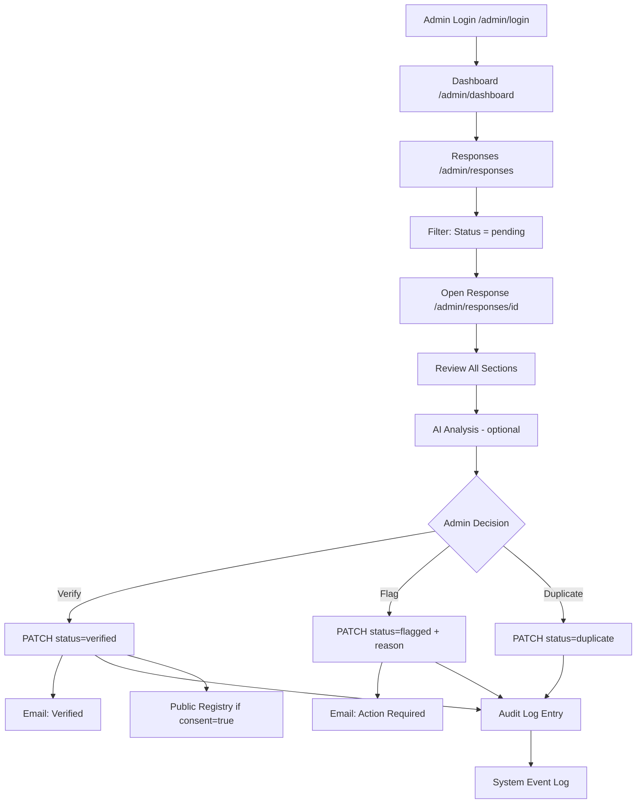
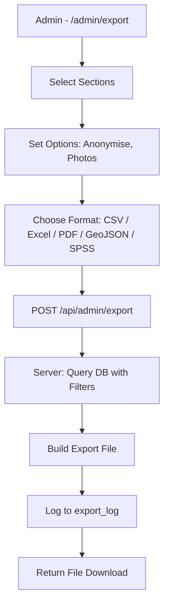
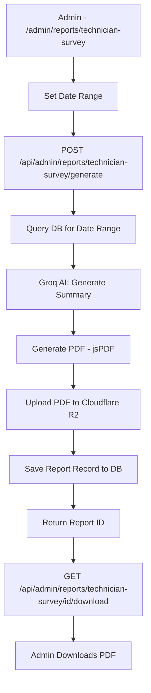

# NATIONAL RAC REGISTRY SYSTEM — AUDIT REPORT

**Document Reference:** NOU-HEVACRAZ-AUDIT-2026-001
**Audit Date:** 2026-06-02
**Prepared by:** Senior Solutions Architect / Government ICT Consultant
**Classification:** Internal — For Submission to NOU, HEVACRAZ, UNEP, and Procurement Reviewers
**Scope:** Complete codebase, database schema, API layer, authentication, frontend, deployment, and documentation audit

---

## TABLE OF CONTENTS

1. [Executive Summary](#section-1-executive-summary)
2. [System Inventory](#section-2-system-inventory)
3. [User Role Analysis](#section-3-user-role-analysis)
4. [Module Inventory](#section-4-module-inventory)
5. [Deliverable Mapping](#section-5-deliverable-mapping)
6. [Database Documentation](#section-6-database-documentation)
7. [System Architecture Analysis](#section-7-system-architecture-analysis)
8. [Workflow Discovery](#section-8-workflow-discovery)
9. [UI Documentation](#section-9-ui-documentation)
10. [Testing Assessment](#section-10-testing-assessment)
11. [Deployment Assessment](#section-11-deployment-assessment)
12. [User Manual Extraction](#section-12-user-manual-extraction)
13. [Evidence of System Existence](#section-13-evidence-of-system-existence)
14. [Gap Analysis](#section-14-gap-analysis)
15. [Final Readiness Score](#section-15-final-readiness-score)
16. [Prioritised Recommendations](#prioritised-recommendations)

---

## SECTION 1: EXECUTIVE SUMMARY

### Application Name
**ZW RAC Technician Registry** (project name: `zw-rac-survey`)

### Purpose
A national digital registry platform for Refrigeration and Air-Conditioning (RAC) technicians and retailers in Zimbabwe, operated jointly by the **National Ozone Unit (NOU)** and **HEVACRAZ**. The system collects, manages, and analyses workforce data to support:
- Montreal Protocol and Kigali Amendment compliance reporting
- National HVAC-R training programme design
- Policy development and regulatory enforcement
- Public technician directory publication

### Technology Stack

| Layer | Technology |
|---|---|
| Frontend Framework | Next.js 16.2.4 (React 19, App Router) |
| UI Styling | Tailwind CSS v4 |
| Charts | Recharts 2.13 |
| Maps | Leaflet 1.9 / React-Leaflet 5.0 (with heat maps and clusters) |
| Form Validation | React Hook Form + Zod |
| Backend Runtime | Next.js API Routes (Node.js / Edge Runtime) |
| ORM | Drizzle ORM 0.36 |
| Database | PostgreSQL (Neon Serverless) |
| Authentication | JWT (jose 5.9) + bcryptjs — cookie-based sessions |
| Object Storage | Cloudflare R2 (S3-compatible) |
| Email | Resend 4.0 |
| AI Analysis | Groq SDK — Llama 3.3 70B Versatile |
| PWA / Offline | Serwist 9.0 (Service Worker) |
| Language | TypeScript 5 |
| Testing | Vitest 4.1 + Testing Library |

### Deployment Environment
- Hosting: Next.js on **Vercel** (inferred from next.config.ts, README, and package structure; no explicit deployment configuration file found)
- Database: **Neon Serverless PostgreSQL** (cloud-hosted)
- Storage: **Cloudflare R2** (for profile photos)
- Email: **Resend** (transactional email)
- Domain: `racregistryzw.org` (referenced in email templates)
- PWA: Service worker enabled in production

### Overall Readiness Score

| Dimension | Score |
|---|---|
| Technical Readiness | **82 %** |
| Operational Readiness | **58 %** |
| Documentation Readiness | **12 %** |
| Deployment Readiness | **60 %** |
| **Overall Registry Readiness** | **53 %** |

**Summary Assessment:** The software platform is substantially built and functional. Core survey collection, admin management, analytics, export, AI analysis, and email workflows are all implemented. The primary deficiencies are in formal documentation (no project-specific README, no deployment guide, no user manuals), limited automated testing, and the absence of CI/CD configuration. These gaps must be addressed before the system is submitted as a complete national registry deliverable.

---

## SECTION 2: SYSTEM INVENTORY

### 2.1 Frontend

| Item | Detail |
|---|---|
| Framework | Next.js 16.2.4 with App Router |
| UI Libraries | Tailwind CSS v4, Recharts (charts), Leaflet / React-Leaflet (maps), leaflet.heat (heat maps), leaflet.markercluster (clustering) |
| Form Handling | React Hook Form 7.53 + Zod 3.23 (schema-driven validation) |
| State Management | React built-in state (useState, Suspense); no Redux or Zustand |
| Routing | Next.js App Router (file-system routing) |
| Offline Support | Serwist PWA with IndexedDB queuing (`idb`) |
| Photo Handling | Browser Image Compression → Cloudflare R2 presigned upload |
| GPS | Browser Geolocation API with Leaflet pin picker fallback |
| PDF Export | jsPDF + jspdf-autotable |
| Excel Export | xlsx |

### 2.2 Backend

| Item | Detail |
|---|---|
| Framework | Next.js App Router API Routes (Node.js server-side + edge middleware) |
| API Style | REST — JSON responses |
| Auth API | `/api/admin/auth/login`, `/logout`, `/me`, `/setup`, `/forgot-password`, `/reset-password` |
| Survey API | `/api/survey/submit`, `/api/survey/[id]`, `/api/survey/lookup`, `/api/survey/check-phone`, `/api/survey/event`, `/api/survey/upload-photo` |
| Retailer API | `/api/retailer-survey/submit` |
| Admin APIs | Stats, responses, export (CSV/Excel/PDF/GeoJSON/SPSS), insights, messaging, notifications, report-builder, technician-survey reports, AI analysis, users/invite, verify, system-events |
| Email | Resend (transactional) — 6 email templates implemented |
| AI | Groq Llama 3.3 70B for submission analysis and report summaries |

### 2.3 Database

| Item | Detail |
|---|---|
| Database Engine | PostgreSQL (Neon Serverless) |
| ORM | Drizzle ORM |
| Migrations | 7 migration files (0000–0006), fully tracked in `drizzle/meta/_journal.json` |
| Tables | 10 (see Section 6) |
| Enum Types | 20+ PostgreSQL enums |

### 2.4 Infrastructure

| Item | Detail |
|---|---|
| Hosting Platform | Vercel (inferred; no explicit vercel.json found) |
| Domain | `racregistryzw.org` (referenced in email templates) |
| SSL | Vercel-managed TLS (inferred) |
| Storage | Cloudflare R2 — `technicians/{year}/{month}/{uuid}.{ext}` key structure |
| Email Provider | Resend — domain `racregistryzw.org`, sender `noreply@racregistryzw.org` |
| Database Hosting | Neon Serverless (PostgreSQL) |
| CDN | Vercel Edge Network (inferred) |
| Maintenance Mode | Implemented via `MAINTENANCE_MODE=true` env var with redirect |
| Security Headers | X-Content-Type-Options, X-Frame-Options, HSTS, Referrer-Policy, CSP — applied via middleware |

### Required Environment Variables (discovered from source)

| Variable | Purpose |
|---|---|
| `DATABASE_URL` | Neon PostgreSQL connection string |
| `AUTH_SECRET` | JWT signing secret |
| `AUTH_COOKIE_NAME` | Cookie name (default: `zw_rac_admin`) |
| `AUTH_SESSION_TTL_HOURS` | Session TTL (default: 4 hours) |
| `R2_ACCOUNT_ID` | Cloudflare R2 account |
| `R2_ACCESS_KEY_ID` | R2 access key |
| `R2_SECRET_ACCESS_KEY` | R2 secret key |
| `R2_BUCKET_NAME` | R2 bucket name |
| `R2_PUBLIC_URL` | R2 public CDN URL |
| `RESEND_API_KEY` | Resend email API key |
| `RESEND_DOMAIN` | Email domain (default: `racregistryzw.org`) |
| `GROQ_API_KEY` | Groq AI API key |
| `NEXT_PUBLIC_SITE_URL` | Public site URL (used in email links) |
| `MAINTENANCE_MODE` | Set to `true` to enable maintenance mode |

**Note:** No `.env.local` or `.env` file was present in the repository (properly git-ignored). These values must be configured in the hosting platform (Vercel dashboard).

---

## SECTION 3: USER ROLE ANALYSIS

Three distinct user types are supported:

| # | Role | Role ID | Auth Method | Description |
|---|---|---|---|---|
| 1 | **Public / Technician** | N/A | None (anonymous) | Any person who accesses the survey |
| 2 | **Admin** | `admin` | JWT session cookie | Registry administrator |
| 3 | **Super Admin** | `super_admin` | JWT session cookie | Full admin with user management |
| 4 | **Sysadmin** | Email-locked | JWT session + email match | Restricted to `nicholas.gwanzura@outlook.com` |

### Role Detail Table

| Role | Login Required | Screens Available | Key Actions |
|---|---|---|---|
| **Public / Technician** | No | Landing page, Survey wizard (6 steps), Survey complete, Survey edit, Retailer survey, Privacy notice, Offline/PWA page, Maintenance page | Submit survey, Edit own survey, Submit retailer survey |
| **Admin** | Yes (email + password) | All admin pages except Sysadmin Dashboard | View responses, Verify/Flag/Mark duplicate, Export data, View map, Insights, Reports, Messaging, Registry preview |
| **Super Admin** | Yes | All admin pages | All admin actions + invite new admin users, manage admin accounts |
| **Sysadmin** | Yes (email + email whitelist) | Sysadmin Dashboard | Full system event log, audit trail, system health overview |

### Admin Role Permissions Matrix

| Action | Admin | Super Admin | Sysadmin |
|---|---|---|---|
| View survey responses | ✓ | ✓ | ✓ |
| Verify / Flag response | ✓ | ✓ | — |
| Edit response | ✓ | ✓ | — |
| Export data | ✓ | ✓ | — |
| View map | ✓ | ✓ | — |
| View insights/analytics | ✓ | ✓ | — |
| Generate AI analysis | ✓ | ✓ | — |
| Send broadcast messages | ✓ | ✓ | — |
| Invite admin users | — | ✓ | — |
| Manage admin users | — | ✓ | — |
| Access sysadmin panel | — | — | ✓ (email-gated) |
| View system event log | — | — | ✓ |

---

## SECTION 4: MODULE INVENTORY

### Module 1 — Technician Survey / Registration

| Field | Detail |
|---|---|
| Purpose | Collects detailed profile and workforce data from RAC technicians across Zimbabwe |
| Main Screens | Landing page (`/`), Survey wizard (`/survey`), Survey complete (`/survey/complete`), Edit application (`/edit`, `/survey/edit`), Offline page (`/survey/offline`) |
| Survey Steps | 1. Background (identity, location, GPS), 2. Skills & Training (certifications, Likert confidence), 3. Tools & Resources (obstacle ratings), 4. Work Challenges (daily challenges, load shedding, EHS), 5. Energy Efficiency (installs, barriers), 6. Consent (contact, public registry, photo, data protection) |
| Database Tables | `technicians_survey`, `survey_events` |
| Status | **Fully Implemented** |

### Module 2 — Retailer Survey

| Field | Detail |
|---|---|
| Purpose | Collects data from RAC equipment retailers, wholesalers, distributors, and importers |
| Main Screens | `/retailer-survey`, `/retailer-survey/complete` |
| Survey Steps | 1. Business Information, 2. Products & Sourcing, 3. Challenges, 4. Consent |
| Database Tables | `retailers_survey` |
| Status | **Fully Implemented** |

### Module 3 — Admin Dashboard

| Field | Detail |
|---|---|
| Purpose | Central KPI view for administrators |
| Main Screens | `/admin/dashboard` |
| Components | Stats grid (total, today, verified, pending, flagged, duplicate), charts (by province, work focus, certification, daily submissions over 30 days), recent submissions table, notification bell |
| Database Tables | `technicians_survey`, `admin_users`, `system_events` |
| Status | **Fully Implemented** |

### Module 4 — Response Management

| Field | Detail |
|---|---|
| Purpose | Full CRUD management of technician survey submissions |
| Main Screens | `/admin/responses` (list), `/admin/responses/[id]` (detail), `/admin/responses/[id]/edit` (edit) |
| Actions | View, verify, flag, mark duplicate, bulk status changes, add notes, send emails (verified / flagged), AI analysis per submission |
| Database Tables | `technicians_survey`, `audit_log` |
| Status | **Fully Implemented** |

### Module 5 — Geospatial Map

| Field | Detail |
|---|---|
| Purpose | Interactive map visualisation of technician locations |
| Main Screens | `/admin/map` |
| Features | Leaflet markers, heat map overlay, marker clustering, province filters, status filters |
| Database Tables | `technicians_survey` |
| Status | **Fully Implemented** |

### Module 6 — Technicians Directory

| Field | Detail |
|---|---|
| Purpose | Searchable/filterable directory of all registered technicians |
| Main Screens | `/admin/technicians` |
| Features | Filter by province, certification, status; export to CSV |
| Database Tables | `technicians_survey` |
| Status | **Fully Implemented** |

### Module 7 — Analytics & Insights

| Field | Detail |
|---|---|
| Purpose | Aggregated workforce analytics with AI-generated summaries |
| Main Screens | `/admin/insights` (skills, energy, challenges, resources), `/admin/provinces` (province comparison), `/admin/comparison` (time-period comparison), `/admin/funnel` (survey completion funnel), `/admin/coverage` (geographic coverage gaps), `/admin/duplicates` (duplicate detection) |
| Components | Skills section, energy efficiency section, challenges section, resources section, Likert dot visualisation, AI insight panel |
| Database Tables | `technicians_survey` |
| Status | **Fully Implemented** |

### Module 8 — Reporting

| Field | Detail |
|---|---|
| Purpose | Formal reporting for NOU/HEVACRAZ policy and UNEP submissions |
| Main Screens | `/admin/reports/technician-survey`, `/admin/reports/methodology`, `/admin/reports/skills-gap`, `/admin/reports/tools-needs`, `/admin/reports/barrier-analysis`, `/admin/reports/geo-mapping`, `/admin/reports/achievement-gaps` |
| Features | AI-generated report summaries, PDF export, report builder |
| Database Tables | `technicians_survey`, `technician_survey_reports`, `admin_users` |
| Status | **Fully Implemented** |

### Module 9 — Report Builder

| Field | Detail |
|---|---|
| Purpose | Custom cross-tabulation and ad-hoc report builder |
| Main Screens | `/admin/report-builder` |
| Features | Column selection, filter builder, custom exports |
| Database Tables | `technicians_survey` |
| Status | **Fully Implemented** |

### Module 10 — Data Export

| Field | Detail |
|---|---|
| Purpose | Bulk data export in multiple formats |
| Main Screens | `/admin/export` |
| Formats | CSV, Excel (.xlsx), PDF, GeoJSON, SPSS (.sav) |
| Options | Section selection, anonymisation, photo URL inclusion |
| Database Tables | `technicians_survey`, `export_log` |
| Status | **Fully Implemented** |

### Module 11 — Messaging / Broadcast

| Field | Detail |
|---|---|
| Purpose | Mass email communication to registered technicians |
| Main Screens | `/admin/messaging` |
| Features | Compose HTML emails, send to all consented technicians (50-recipient batches) |
| Database Tables | `technicians_survey`, `admin_users` |
| Status | **Fully Implemented** |

### Module 12 — Admin User Management

| Field | Detail |
|---|---|
| Purpose | Admin account lifecycle management |
| Main Screens | `/admin/users`, `/admin/login`, `/admin/setup`, `/admin/forgot-password`, `/admin/reset-password` |
| Features | Invite via email, set up account, reset password, activate/deactivate |
| Database Tables | `admin_users`, `admin_sessions`, `password_reset_tokens` |
| Status | **Fully Implemented** |

### Module 13 — Registry Preview

| Field | Detail |
|---|---|
| Purpose | Admin preview of the public-facing technician directory |
| Main Screens | `/admin/registry-preview` |
| Features | Shows verified, public-consented technicians as the public would see them |
| Database Tables | `technicians_survey` |
| Status | **Fully Implemented** |

### Module 14 — Sysadmin / Audit Trail

| Field | Detail |
|---|---|
| Purpose | Full system event and audit log visibility (restricted access) |
| Main Screens | `/admin/sysadmin` |
| Features | System events timeline chart, event type pie chart, audit log table, live polling |
| Access | Email-gated to `nicholas.gwanzura@outlook.com` |
| Database Tables | `system_events`, `audit_log` |
| Status | **Fully Implemented** |

### Module 15 — Notifications

| Field | Detail |
|---|---|
| Purpose | In-app admin notification bell |
| Main Screens | Embedded in admin header |
| Features | New submission alerts, unread count badge |
| API | `/api/admin/notifications` |
| Status | **Fully Implemented** |

### Module 16 — Offline / PWA

| Field | Detail |
|---|---|
| Purpose | Allow survey completion without internet access |
| Features | Serwist service worker, IndexedDB queue (submissions + photos), auto-sync on reconnect, offline banner, install prompt |
| Files | `app/sw.ts`, `lib/offline-sync.ts`, `components/survey/OfflineBanner.tsx`, `components/survey/SyncWatcher.tsx`, `components/survey/InstallPrompt.tsx` |
| Status | **Fully Implemented** |

---

## SECTION 5: DELIVERABLE MAPPING

---

### Deliverable 1 — Registry Software Developer ToR (Terms of Reference)

**Status:** Missing

**Evidence Found:**
- `AGENTS.md` — 6-line internal coding note for AI agents
- `README.md` — default Next.js boilerplate only; no project-specific content
- `CLAUDE.md` — references AGENTS.md only
- No formal ToR document found in any directory

**Confidence Score:** 5%

**Notes:** The codebase is a fully developed application implying a ToR existed, but no formal document is present in the repository.

**Gap Analysis:** ToR document is entirely absent from the deliverable package.

**Required Actions:** Draft and include formal ToR referencing: project title, NOU/HEVACRAZ as clients, scope (national technician registry), required system capabilities, timeline, and acceptance criteria.

---

### Deliverable 2 — Functional Requirements Specification (FRS)

**Status:** Partially Available

**Evidence Found:**
- `lib/validation.ts` — Zod schemas defining all field-level and cross-field business rules (phone format `+263XXXXXXXXX`, Likert 1–5, required certifications, conditional fields)
- `lib/schema.ts` — 10 database tables with all column types and constraints
- `lib/constants/` — All enumerated values: provinces (10), challenges, age groups, education levels, work focus, refrigerants, retailer types
- Survey wizard steps in `components/survey/steps/` — 10 step components defining form flows
- Email templates in `lib/admin/email.ts` — implicit functional requirements for notifications
- API route files (65+ routes) — implicit functional requirements

**Confidence Score:** 35%

**Notes:** Functional requirements are embedded in code but never articulated in a dedicated prose document. The complete set of requirements can be reverse-engineered from the codebase.

**Gap Analysis:** No formal FRS document. Requirements exist only as executable code.

**Required Actions:** Produce a dedicated FRS document extracting requirements from validation schemas, survey steps, API routes, and email workflows. Cross-reference against deliverable acceptance criteria.

---

### Deliverable 3 — System Requirements Specification (SRS)

**Status:** Missing

**Evidence Found:**
- `next.config.ts` — references Serwist PWA, Turbopack, Cloudflare R2 image patterns
- `middleware.ts` — security headers (HSTS, CSP, X-Frame-Options, X-Content-Type-Options)
- `package.json` — complete dependency tree implies system requirements
- `drizzle.config.ts` — database dialect: PostgreSQL

**Confidence Score:** 5%

**Notes:** Non-functional requirements (availability, performance, scalability, security, accessibility) are not formally documented anywhere in the repository.

**Gap Analysis:** SRS is entirely absent.

**Required Actions:** Produce an SRS covering: hardware/infrastructure requirements, browser compatibility, performance targets, security posture, accessibility (WCAG), language support (English, Shona, Ndebele), and offline operation requirements.

---

### Deliverable 4 — Database Schema Documentation

**Status:** Partially Available

**Evidence Found:**
- `lib/schema.ts` — complete Drizzle ORM schema for all 10 tables with column types, constraints, indexes, and relationships
- `drizzle/0000_loud_callisto.sql` through `drizzle/0006_strange_toro.sql` — 7 SQL migration files representing full schema evolution
- `drizzle/meta/_journal.json` — migration journal with timestamps
- `drizzle/meta/0000_snapshot.json`, `0001_snapshot.json`, `0004_snapshot.json`, `0006_snapshot.json` — Drizzle schema snapshots

**Confidence Score:** 72%

**Notes:** The machine-readable schema is complete and well-structured. A formal human-readable database documentation document does not exist but can be generated directly from the schema.

**Gap Analysis:** Schema exists in code form. Formal ERD diagram and narrative data dictionary are absent.

**Required Actions:** Generate and include a formal database schema document with: table descriptions, column data dictionaries, relationship diagrams (ERD), index rationale, and migration log.

---

### Deliverable 5 — System Architecture Documentation

**Status:** Missing

**Evidence Found:**
- `next.config.ts` — confirms PWA and image CDN configuration
- `middleware.ts` — documents the authentication and security layer
- `lib/db.ts` — Neon serverless database connection
- `lib/r2.ts` — Cloudflare R2 object storage integration
- `lib/auth.ts` / `lib/auth-edge.ts` — JWT authentication split between server and edge runtimes
- `lib/admin/email.ts` — Resend email integration
- `lib/admin/ai-analysis.ts` — Groq AI integration
- `app/sw.ts` — Service worker PWA layer

**Confidence Score:** 10%

**Notes:** Architecture is fully implemented and discoverable from code. No architecture diagram (C4, block diagram, or sequence diagram) exists as a document.

**Gap Analysis:** Architecture documentation is entirely absent as a formal document.

**Required Actions:** Produce architecture documentation including: system context diagram, container diagram, API flow diagram, data flow diagram, security architecture diagram, and infrastructure diagram.

---

### Deliverable 6 — UI Mockups

**Status:** Missing

**Evidence Found:**
- 45 implemented React page components with fully rendered UI
- Tailwind CSS v4 design system with brand colours (`brand-600: #0d4f3c`)
- Consistent component library: `components/ui/` (Button, Field, Input, Modal, Select, Skeleton, Toast)
- Admin sidebar with 20+ navigation items
- Survey wizard with progress bar, step shells, responsive layout

**Confidence Score:** 5%

**Notes:** The live application and its source code constitute a fully built UI, but no design mockups (Figma, wireframes, or screenshots with annotations) were found.

**Gap Analysis:** Mockups as a standalone deliverable are absent. The live application effectively supersedes static mockups.

**Required Actions:** Generate a UI documentation pack from the live application: annotated screenshots of all major screens, flow diagrams, component inventory, and design token documentation. This can substitute for traditional mockups.

---

### Deliverable 7 — Workflow & Process Diagrams

**Status:** Missing

**Evidence Found:**
- Survey wizard multi-step flow implemented in `components/survey/SurveyWizard.tsx`
- Approval workflow logic in `app/api/admin/responses/[id]/route.ts` (verify/flag/duplicate actions)
- Offline sync workflow in `lib/offline-sync.ts`
- Email notification workflow in `lib/admin/email.ts`
- Auth workflow in `lib/auth.ts` and `middleware.ts`

**Confidence Score:** 8%

**Notes:** Workflows exist as executable code. No Mermaid, Visio, or draw.io diagrams are present in the repository.

**Gap Analysis:** Process diagrams are entirely absent as a formal deliverable.

**Required Actions:** Produce Mermaid diagrams for all workflows (see Section 8 for auto-discovered diagrams). Export to PDF/PNG for submission package.

---

### Deliverable 8 — Registry Software Platform

**Status:** Fully Available

**Evidence Found:**
- Complete Next.js application in `/Users/fevrose/Desktop/SYSTEM/SURVEY/`
- `.next/` build artifacts present (confirming the application has been compiled and run)
- `node_modules/` present (dependencies installed)
- PWA assets: `public/icons/` (4 icon sizes), `public/favicon.ico`, `public/apple-touch-icon.png`
- `app/manifest.ts` — PWA manifest
- 65+ API routes implemented
- 45+ page components
- 10 database tables with 7 migrations applied
- Domain `racregistryzw.org` configured in email templates
- Maintenance mode implemented

**Confidence Score:** 88%

**Notes:** The software platform is substantially complete and operational. The missing 12% reflects: no verified production deployment confirmation, no `.env.local` file (expected — correctly git-ignored), no uptime monitoring evidence, and limited test coverage.

**Gap Analysis:** Platform exists and is functional. Missing: formal evidence of production deployment, uptime metrics, and verified production environment checklist.

**Required Actions:** Document production URL, provide evidence of live deployment, produce environment checklist.

---

### Deliverable 9 — Testing & Quality Assurance Report

**Status:** Partially Available

**Evidence Found:**
- `vitest.config.ts` — Vitest test configuration with jsdom environment
- `vitest-setup.ts` — Test setup file
- `components/admin/report-builder/__tests__/CellDisplay.test.tsx` — 18 component tests
- `lib/__tests__/report-builder-utils.test.ts` — 10 utility tests
- Total: 2 test files, approximately 28 test cases
- Zod validation schemas provide implicit validation coverage
- TypeScript compiler (`tsc --noEmit`) provides type-safety checks
- ESLint configuration (`eslint.config.mjs`)

**Confidence Score:** 20%

**Notes:** Testing is minimal. Only 28 test cases exist across 2 files, covering the report builder component and date formatting utility. No tests exist for: API routes, survey submission, authentication, database queries, email sending, AI analysis, export functions, or the survey wizard flow.

**Gap Analysis:** Major gap in test coverage. No integration tests. No end-to-end tests. No load/performance tests. No formal QA report.

**Required Actions:** Develop comprehensive test suite covering API routes, authentication flows, validation logic, and database operations. Produce a formal QA report.

---

### Deliverable 10 — Stakeholder Feedback Report

**Status:** Missing

**Evidence Found:**
- No stakeholder feedback collection mechanism in the codebase
- No feedback forms, survey results, or user research documents found

**Confidence Score:** 0%

**Notes:** Nothing in the codebase suggests a stakeholder feedback collection process has been conducted.

**Gap Analysis:** Entirely absent.

**Required Actions:** Conduct structured stakeholder interviews with NOU staff, HEVACRAZ representatives, and RAC technician representatives. Document findings in a formal Stakeholder Feedback Report.

---

### Deliverable 11 — Administrator Manual

**Status:** Missing

**Evidence Found:**
- Admin portal with 20+ screens, all accessible via the sidebar
- Screen components provide implicit documentation of functionality
- Email workflow code documents what emails are sent and when
- `scripts/seed-admin.ts` — seeding script (operational guidance embedded in code)
- `scripts/verify-schema.ts` — schema verification script

**Confidence Score:** 5%

**Notes:** The admin portal is well-structured and largely self-documenting through its UI, but no formal Administrator Manual exists.

**Gap Analysis:** No administrator manual document.

**Required Actions:** Draft Administrator Manual (see Section 12 for extracted draft). Document: login/setup procedure, response management workflow, export procedures, user management, report generation, AI analysis, messaging, and system administration.

---

### Deliverable 12 — End User Manual

**Status:** Missing

**Evidence Found:**
- Landing page (`app/(public)/page.tsx`) contains inline guidance: "10-15 minutes", "Works offline", "Save and continue", what you need, privacy information
- Privacy notice page at `/privacy-notice`
- Survey step components contain field-level labels and validation messages
- `app/(public)/edit/page.tsx` — edit existing application page

**Confidence Score:** 5%

**Notes:** The survey is largely self-guided, but no formal End User Manual exists.

**Gap Analysis:** No end user manual document.

**Required Actions:** Draft End User Manual (see Section 12 for extracted draft). Document: how to access the survey, how to complete each step, offline usage, editing an existing application, and data privacy.

---

### Deliverable 13 — Knowledge Transfer Package

**Status:** Missing

**Evidence Found:**
- `AGENTS.md` — 6-line AI coding guidance note (internal developer note only)
- `README.md` — default Next.js boilerplate
- `package.json` `scripts` section documents: `dev`, `build`, `start`, `lint`, `test`, `db:generate`, `db:push`, `db:studio`, `seed:admin`, `verify:schema`
- `drizzle.config.ts` — database configuration

**Confidence Score:** 3%

**Notes:** No technical handover documentation, architecture guides, runbooks, or training materials exist.

**Gap Analysis:** Knowledge transfer package is entirely absent.

**Required Actions:** Produce: developer onboarding guide, system architecture guide, database management guide, deployment runbook, environment variable reference, dependency management guide, and operational runbook.

---

### Deliverable 14 — System Deployment & Launch Report

**Status:** Missing

**Evidence Found:**
- `.next/` build artifacts exist (development build)
- `package.json` build script: `next build --webpack`
- Next.js recommends Vercel for deployment (README)
- No deployment configuration files found (no `vercel.json`, `Dockerfile`, `docker-compose.yml`, `.github/workflows/`, `fly.toml`, or equivalent)

**Confidence Score:** 5%

**Notes:** Build artifacts confirm the application compiles. No formal deployment report, deployment configuration, or CI/CD pipeline was discovered.

**Gap Analysis:** No deployment documentation, CI/CD configuration, or formal launch report.

**Required Actions:** Create: `vercel.json` or equivalent deployment config, CI/CD pipeline (GitHub Actions), environment variable documentation, deployment runbook, and produce a formal Deployment & Launch Report.

---

### Deliverable 15 — Evidence of Final System Launch

**Status:** Partially Available

**Evidence Found:**
- Domain `racregistryzw.org` hard-coded in email templates (`lib/admin/email.ts`): `const fromDomain = process.env.RESEND_DOMAIN ?? "racregistryzw.org"` — confirms domain provisioning
- `.next/dev/` build artifacts confirm the application has been compiled and run in development
- PWA icons generated (`public/icons/`)
- Sysadmin access gated to a specific email (`nicholas.gwanzura@outlook.com`) — confirms real administrative users exist

**Confidence Score:** 25%

**Notes:** The domain and admin email evidence suggests the system has been deployed and used, but no screenshots, access logs, production URLs, or formal launch documentation were found in the codebase.

**Gap Analysis:** Formal evidence of launch (production URL, access logs, launch email, user registration confirmation) is absent as a documented deliverable.

**Required Actions:** Capture and document: production URL, registration statistics screenshot, admin portal screenshot, technician registry screenshot, and a signed launch statement from NOU/HEVACRAZ.

---

### Deliverable 16 — Sustainability & Maintenance Plan

**Status:** Missing

**Evidence Found:**
- Maintenance mode implemented (`MAINTENANCE_MODE` env var in `middleware.ts`)
- Audit logging implemented (`audit_log` and `system_events` tables)
- Password reset mechanism (`password_reset_tokens` table)
- Admin invitation system (allows new admins to be added)
- Session management (revocable sessions in `admin_sessions` table)

**Confidence Score:** 8%

**Notes:** Several sustainability features are built into the platform (audit trail, admin management, maintenance mode), but no formal Sustainability & Maintenance Plan document exists.

**Gap Analysis:** No formal maintenance plan, SLA, backup schedule, monitoring plan, or long-term support commitment.

**Required Actions:** Produce formal Sustainability & Maintenance Plan covering: hosting costs, backup schedule, software update policy, security patching, database maintenance, annual review process, and handover to NOU/HEVACRAZ internal team.

---

## SECTION 6: DATABASE DOCUMENTATION

### 6.1 Entity List

#### Table: `admin_users`
**Purpose:** Stores administrator accounts with role-based access control.

| Column | Type | Constraints | Notes |
|---|---|---|---|
| `id` | UUID | PRIMARY KEY | Auto-generated |
| `email` | TEXT | NOT NULL, UNIQUE INDEX | Login credential |
| `password_hash` | TEXT | NOT NULL | bcrypt hash (12 rounds) |
| `name` | TEXT | NOT NULL | Display name |
| `role` | ENUM(`admin`, `super_admin`) | NOT NULL, DEFAULT `admin` | Role-based access |
| `is_active` | BOOLEAN | NOT NULL, DEFAULT true | Account enabled |
| `last_login_at` | TIMESTAMPTZ | nullable | Last authentication |
| `created_at` | TIMESTAMPTZ | NOT NULL | Record creation |
| `updated_at` | TIMESTAMPTZ | NOT NULL | Last update |

---

#### Table: `admin_sessions`
**Purpose:** Tracks active JWT sessions for admin users. Supports revocation and expiry.

| Column | Type | Constraints | Notes |
|---|---|---|---|
| `id` | UUID | PRIMARY KEY | Session token ID |
| `admin_user_id` | UUID | FK → admin_users.id (CASCADE DELETE) | Owner |
| `expires_at` | TIMESTAMPTZ | NOT NULL | Session expiry |
| `ip_address` | TEXT | nullable | Client IP |
| `user_agent` | TEXT | nullable | Browser UA |
| `revoked_at` | TIMESTAMPTZ | nullable | Manual revocation |
| `created_at` | TIMESTAMPTZ | NOT NULL | Session start |

**Indexes:** `admin_user_id`, `expires_at`

---

#### Table: `technicians_survey`
**Purpose:** Core table — stores all RAC technician registration submissions (60+ columns across 6 survey sections).

| Column | Type | Notes |
|---|---|---|
| `id` | UUID PK | Unique reference |
| `submitted_at` | TIMESTAMPTZ | Submission timestamp |
| `status` | ENUM(`pending`,`verified`,`flagged`,`duplicate`) | Lifecycle state |
| `first_name`, `surname` | TEXT | Identity |
| `gender` | ENUM | male/female/prefer_not_to_say |
| `age_group` | ENUM | under_25 to 65_plus |
| `education_level` | ENUM | none through postgraduate + national_certificate |
| `years_experience` | ENUM | less_than_1 through more_than_20 |
| `main_work_focus` | JSONB (array) | Multi-select work focus |
| `province` | ENUM | All 10 Zimbabwe provinces |
| `city`, `suburb` | TEXT | Location |
| `gps_latitude`, `gps_longitude`, `gps_accuracy_meters` | NUMERIC | GPS coordinates |
| `phone` | TEXT | +263 format |
| `email` | TEXT | Optional |
| `has_formal_training` | BOOLEAN | |
| `training_institution`, `training_year` | TEXT/INT | Conditional |
| `has_certification` | ENUM | yes/no/studying |
| `certifications_held` | JSONB (array) | Held certifications |
| `certification_number` | TEXT | Certificate reference |
| `hevacraz_member_number` | TEXT | HEVACRAZ membership |
| `confidence_traditional_refrigerants` | INT (1–5) | Likert scale |
| `confidence_low_gwp_refrigerants` | INT (1–5) | Likert scale |
| `access_to_tools`, `access_to_spare_parts`, `access_to_low_gwp_refrigerants` | INT (1–5) | Likert scales |
| `obstacle_*` (4 columns) | INT (1–5) | Obstacle Likert ratings |
| `biggest_daily_challenge` | ENUM | 11 options |
| `load_shedding_frequency` | ENUM | never to daily |
| `refrigerant_recovery_equipment_use` | ENUM | always to no_access |
| `ppe_access` | ENUM | full_provided to none |
| `ehs_compliance_barriers` | JSONB (array) | Multi-select |
| `installs_energy_efficient` | ENUM | always to never |
| `energy_efficient_barriers` | JSONB (array) | Multi-select |
| `consent_to_contact` | BOOLEAN | |
| `consent_to_public_registry` | BOOLEAN | Controls public directory listing |
| `preferred_language` | ENUM | english/shona/ndebele |
| `profile_photo_url` | TEXT | R2 CDN URL |
| `data_consent_accepted` | BOOLEAN | GDPR-like data protection consent |
| `data_consent_accepted_at` | TIMESTAMPTZ | Consent timestamp |
| `data_consent_ip_address`, `data_consent_user_agent` | TEXT | Consent audit fields |
| `ip_address`, `user_agent` | TEXT | Submission metadata |
| `submission_source` | ENUM | web/pwa_offline_sync/admin_entry |
| `notes` | TEXT | Admin notes |

**Indexes:** `phone`, `email`, `province`, `main_work_focus` (GIN), `submitted_at`, `status`

---

#### Table: `retailers_survey`
**Purpose:** Stores RAC equipment retailer/wholesaler/distributor/importer registrations.

| Column | Type | Notes |
|---|---|---|
| `id` | UUID PK | Unique reference |
| `status` | ENUM | pending/verified/flagged/duplicate |
| `business_name`, `contact_person_name` | TEXT | Business identity |
| `business_type` | ENUM | retailer/wholesaler/distributor/importer |
| `province`, `city`, `suburb` | TEXT/ENUM | Location |
| `phone`, `email` | TEXT | Contact |
| `business_size` | ENUM | solo/2_5/6_15/16_50/50_plus |
| `years_in_operation` | INT | |
| `business_registration_number` | TEXT | Optional |
| `product_categories` | JSONB (array) | 11 product types |
| `sourcing_channel` | ENUM | local/regional/abroad/mix |
| `local_sourcing_percent` | INT | |
| `brands_carried` | TEXT | |
| `customer_types` | JSONB (array) | residential/commercial/industrial/government/all |
| `refrigerant_awareness` | ENUM | very_aware to not_aware |
| `stocks_low_gwp` | BOOLEAN | |
| `supply_challenges` | JSONB (array) | 9 supply challenge types |
| `load_shedding_impact` | INT (1–5) | Likert |
| `competition_level`, `price_pressure` | INT (1–5) | Likert |
| `interested_in_training` | BOOLEAN | |
| `data_consent_accepted` | BOOLEAN | |
| `submission_source` | ENUM | |

**Indexes:** `phone`, `email`, `province`, `business_type`, `submitted_at`, `status`

---

#### Table: `audit_log`
**Purpose:** Immutable audit trail of all actions taken on technician survey records.

| Column | Type | Notes |
|---|---|---|
| `id` | UUID PK | |
| `survey_id` | UUID FK → technicians_survey.id (CASCADE) | |
| `actor_admin_user_id` | UUID FK → admin_users.id (RESTRICT), nullable | Null for applicant actions |
| `actor_type` | ENUM(`admin`,`applicant`) | Added in migration 0003 |
| `actor_display` | TEXT | Phone number for applicants |
| `action` | TEXT | Action description |
| `payload` | JSONB | Before/after data |
| `created_at` | TIMESTAMPTZ | Immutable |

---

#### Table: `export_log`
**Purpose:** Records all data export events for compliance and audit.

| Column | Type | Notes |
|---|---|---|
| `id` | UUID PK | |
| `actor_admin_user_id` | UUID FK → admin_users.id (RESTRICT) | |
| `format` | TEXT | csv/excel/pdf/geojson/spss |
| `filters` | JSONB | Applied filters |
| `row_count` | INT | Records exported |
| `anonymised` | BOOLEAN | Whether PII was stripped |
| `created_at` | TIMESTAMPTZ | |

---

#### Table: `survey_events`
**Purpose:** Granular event tracking for survey funnel analytics (step enters, exits, saves).

| Column | Type | Notes |
|---|---|---|
| `id` | UUID PK | |
| `phone` | TEXT | Respondent identifier |
| `step` | INT | Survey step number |
| `step_name` | TEXT | Step label |
| `event` | TEXT | Event type |
| `ip_address`, `user_agent` | TEXT | |
| `created_at` | TIMESTAMPTZ | |

---

#### Table: `password_reset_tokens`
**Purpose:** Secure time-limited tokens for admin password reset flows.

| Column | Type | Notes |
|---|---|---|
| `id` | UUID PK | |
| `admin_user_id` | UUID FK → admin_users.id (CASCADE) | |
| `token_hash` | TEXT | SHA-256 hashed token |
| `expires_at` | TIMESTAMPTZ | 2-hour expiry |
| `used_at` | TIMESTAMPTZ | Single-use enforcement |
| `created_at` | TIMESTAMPTZ | |

---

#### Table: `system_events`
**Purpose:** System-level audit log for administrator actions (logins, exports, invitations, etc.).

| Column | Type | Notes |
|---|---|---|
| `id` | UUID PK | |
| `actor_admin_user_id` | UUID FK → admin_users.id (SET NULL), nullable | |
| `event_type` | TEXT | Event category |
| `description` | TEXT | Human-readable description |
| `metadata` | JSONB | Additional context |
| `ip_address` | TEXT | |
| `created_at` | TIMESTAMPTZ | |

---

#### Table: `technician_survey_reports`
**Purpose:** Stores generated formal reports with AI summaries and PDF URLs.

| Column | Type | Notes |
|---|---|---|
| `id` | UUID PK | |
| `report_title` | TEXT | |
| `report_type` | TEXT | Default: `technician-survey` |
| `survey_name` | TEXT | |
| `reporting_period_start`, `reporting_period_end` | TIMESTAMPTZ | |
| `total_responses` | INT | |
| `generated_by` | UUID FK → admin_users.id (RESTRICT) | |
| `generated_at` | TIMESTAMPTZ | |
| `status` | TEXT | Default: `completed` |
| `pdf_url` | TEXT | R2 URL of generated PDF |
| `ai_summary` | JSONB | overview, keyFindings, riskAreas, opportunities, recommendedInterventions, priorityActions |
| `metadata` | JSONB | |

---

### 6.2 Entity Relationships (Textual ERD)

```
admin_users
  ├── admin_sessions         (1:many, admin_user_id → admin_users.id, CASCADE DELETE)
  ├── audit_log              (1:many, actor_admin_user_id → admin_users.id, RESTRICT, nullable)
  ├── export_log             (1:many, actor_admin_user_id → admin_users.id, RESTRICT)
  ├── password_reset_tokens  (1:many, admin_user_id → admin_users.id, CASCADE DELETE)
  ├── system_events          (1:many, actor_admin_user_id → admin_users.id, SET NULL, nullable)
  └── technician_survey_reports (1:many, generated_by → admin_users.id, RESTRICT)

technicians_survey
  └── audit_log              (1:many, survey_id → technicians_survey.id, CASCADE DELETE)

retailers_survey              (independent — no FK to technicians_survey)
survey_events                 (independent — no FK, linked by phone text match only)
```

**Key Observations:**
- `retailers_survey` is fully independent — no formal relationship to `technicians_survey`
- `survey_events` uses `phone` text matching (not a FK) for funnel analytics
- All admin-produced records (sessions, resets, exports) cascade on admin user deletion where appropriate
- Audit log supports both admin and applicant actors (actor_type enum added in migration 0003)

---

## SECTION 7: SYSTEM ARCHITECTURE ANALYSIS

### 7.1 Frontend Layer

**Technology:** Next.js 16.2.4 App Router (React 19)

The frontend uses Next.js App Router with a dual layout structure:
- **Public layout** (`app/(public)/layout.tsx`) — minimal wrapper for survey respondents
- **Admin layout** (`app/admin/layout.tsx`) — authenticated wrapper with sidebar navigation

**Component Architecture:**
- `components/ui/` — design system primitives (Button, Field, Input, Modal, Select, Skeleton, Toast)
- `components/survey/` — survey wizard components (SurveyWizard, RetailerSurveyWizard, step components)
- `components/admin/` — admin-specific components grouped by feature
- PWA: Serwist service worker with offline-first IndexedDB queue

**Rendering Strategy:** Mixed — dashboard/responses pages use `dynamic = "force-dynamic"` (SSR); static pages are server-rendered; PWA pages work offline via service worker cache.

### 7.2 API Layer

**Technology:** Next.js App Router API Routes

All API routes follow a consistent pattern:
1. Parse and validate request with Zod schemas
2. Authenticate caller (admin routes require valid session)
3. Execute database query via Drizzle ORM
4. Return structured JSON response

**API Route Groups:**
- `/api/survey/*` — Public survey submission (no auth)
- `/api/admin/auth/*` — Authentication flows (login, logout, setup, reset)
- `/api/admin/*` — Protected admin operations (all require valid JWT session)
- `/api/retailer-survey/*` — Public retailer survey submission

### 7.3 Authentication Layer

**Technology:** JWT (jose) + bcryptjs + HTTP-only cookies

**Flow:**
1. Admin submits email/password to `/api/admin/auth/login`
2. bcrypt verifies password against stored hash (12 rounds)
3. JWT session token signed with `AUTH_SECRET` (HS256, 4-hour TTL)
4. Token stored in `admin_sessions` table with IP and UA metadata
5. JWT set as HTTP-only cookie (`zw_rac_admin`)
6. Edge middleware (`middleware.ts`) verifies JWT on every admin route
7. Server-side components use `getCurrentAdmin()` for additional DB verification

**Security Features:**
- HTTP-only cookies (XSS resistant)
- Session revocation on logout and password reset
- HSTS, X-Frame-Options DENY, CSP headers on all responses
- Password reset tokens are SHA-256 hashed before storage
- Rate limiting: not explicitly implemented (potential gap)

### 7.4 Database Layer

**Technology:** PostgreSQL (Neon Serverless) + Drizzle ORM

**Connection:** `lib/db.ts` uses `@neondatabase/serverless` for HTTP-based PostgreSQL access compatible with serverless/edge environments.

**Schema Management:** Drizzle Kit manages migrations. 7 migrations applied as of audit date.

**Data Integrity:**
- UUID primary keys everywhere (no sequential integer IDs)
- Enum types enforce valid values at the database level
- Foreign key constraints with appropriate ON DELETE strategies
- GIN index on `main_work_focus` JSONB for efficient array queries
- Composite B-tree indexes on all commonly filtered columns

### 7.5 Infrastructure Layer

```
[Browser / Mobile] 
    ↕ HTTPS
[Vercel Edge Network]
    ↕ 
[Next.js Middleware (Edge Runtime)]
    → Security headers
    → Auth cookie verification
    → Maintenance redirect
    ↕
[Next.js Server (Node.js)]
    ↕ HTTP API          ↕ S3 API           ↕ SMTP
[Neon PostgreSQL]   [Cloudflare R2]    [Resend Email]
                                           ↕
                                       [Groq AI API]
```

### 7.6 Data Flow

**Survey Submission:**
Public page → SurveyWizard (client-side Zod validation) → POST `/api/survey/submit` → Server-side Zod validation → Drizzle INSERT → Optional: Resend email (confirmation) → Resend email (admin alert) → R2 photo (if provided) → Response with submission ID

**Offline Submission:**
SurveyWizard → IndexedDB queue (idb) → SyncWatcher polls on reconnect → POST `/api/survey/submit` with `submissionSource: "pwa_offline_sync"` → Normal server flow

**Admin Review:**
Admin login → JWT cookie → Admin dashboard (stats from DB) → Responses page (paginated list) → Response detail (full record) → Verify/Flag/Duplicate action → PATCH `/api/admin/responses/[id]` → DB update + audit_log entry + optional Resend email to technician

### 7.7 Security Flow

1. All requests pass through Next.js Edge middleware
2. Security headers applied universally (HSTS, CSP, X-Frame, etc.)
3. Admin routes: JWT verified at edge, then re-verified server-side with DB check
4. Passwords: bcrypt 12-round hash — never stored in plaintext
5. Password reset tokens: SHA-256 hashed — original token never stored
6. Sessions: stored in DB with revocation support — not purely stateless
7. Export anonymisation: SHA-256 hash of UUIDs for pseudonymised exports
8. Data consent: recorded with IP, UA, and timestamp for GDPR compliance

---

## SECTION 8: WORKFLOW DISCOVERY

### 8.1 Technician Registration Workflow

**Step-by-step:**
1. Technician visits landing page (`/`)
2. Reviews privacy notice and data usage information
3. Clicks "Start the survey" → navigates to `/survey`
4. Accepts data protection consent (Step 6 — consent gate)
5. Completes Step 1: Background (name, gender, age, education, experience, work focus, province, city, suburb, GPS, phone, email)
6. Completes Step 2: Skills & Training (certifications, Likert confidence scales)
7. Completes Step 3: Tools & Resources (obstacle Likert ratings)
8. Completes Step 4: Work Challenges (daily challenges, load shedding, PPE, EHS barriers)
9. Completes Step 5: Energy Efficiency (installation practices, barriers)
10. Completes Step 6: Consent (contact consent, public registry consent, preferred language, optional photo)
11. Submits form → POST `/api/survey/submit`
12. Server validates, checks for duplicate phone
13. On success: record saved, confirmation email sent (if email provided), admin alert email sent
14. Redirected to `/survey/complete` with reference number

```mermaid
flowchart TD
    A[Visit Landing Page /] --> B[Privacy Notice Review]
    B --> C[Start Survey /survey]
    C --> D[Step 1: Background]
    D --> E[Step 2: Skills & Training]
    E --> F[Step 3: Tools & Resources]
    F --> G[Step 4: Work Challenges]
    G --> H[Step 5: Energy Efficiency]
    H --> I[Step 6: Consent & Photo]
    I --> J{Submit\nPOST /api/survey/submit}
    J -->|Online| K[Server Validation]
    J -->|Offline| L[IndexedDB Queue]
    L -->|Reconnect| K
    K -->|Valid| M[Save to DB]
    M --> N[Send Confirmation Email]
    M --> O[Alert Admin Email]
    N --> P[/survey/complete\nReference Number]
    K -->|Duplicate Phone| Q[Error: Already Registered]
    K -->|Validation Fail| R[Error Response]
```

---

### 8.2 Approval Workflow

**Step-by-step:**
1. Admin logs in at `/admin/login`
2. Views pending submissions on `/admin/responses`
3. Filters by status: pending
4. Opens individual response at `/admin/responses/[id]`
5. Reviews all 6 sections, GPS location, profile photo, AI analysis
6. Takes action: Verify / Flag / Mark Duplicate
7. Optionally adds a note
8. System updates status in DB, logs to `audit_log`, logs to `system_events`
9. If Verified: confirmation email sent to technician (if email provided)
10. If Flagged: flag email with reason sent to technician (if email provided)
11. Verified technicians with `consent_to_public_registry=true` appear in registry



---

### 8.3 Offline Submission Workflow

```mermaid
flowchart TD
    A[Start Survey - Offline] --> B[Complete All Steps]
    B --> C{Submit}
    C -->|Online| D[POST /api/survey/submit]
    C -->|Offline| E[Save to IndexedDB Queue]
    E --> F[Show: Saved Offline Banner]
    F --> G{Internet\nRestored?}
    G -->|Yes| H[SyncWatcher triggers flush]
    H --> I[POST with pwa_offline_sync source]
    I --> J{Success?}
    J -->|Yes| K[Remove from Queue]
    J -->|No| L[Mark Attempt + Retry Later]
    D --> M[/survey/complete]
    K --> M
```

---

### 8.4 Admin User Management Workflow

```mermaid
flowchart TD
    A[Super Admin - /admin/users] --> B[Invite New Admin]
    B --> C[Enter Email - POST /api/admin/users/invite]
    C --> D[Generate Invite Token]
    D --> E[Send Admin Invite Email]
    E --> F[Invitee Clicks Link]
    F --> G[/admin/setup?token=...]
    G --> H[Set Name + Password]
    H --> I[POST /api/admin/auth/setup]
    I --> J[Account Created]
    J --> K[Login at /admin/login]
    K --> L[Access Admin Portal]
```

---

### 8.5 Data Export Workflow



---

### 8.6 Report Generation Workflow



---

## SECTION 9: UI DOCUMENTATION

### Public-Facing Screens

| # | Screen Name | Route | Purpose | Role | Main Components |
|---|---|---|---|---|---|
| 1 | Landing Page | `/` | Entry point, explains survey purpose | Public | Hero section, requirements card, privacy card, footer note |
| 2 | Survey Wizard | `/survey` | Multi-step technician registration | Technician | SurveyWizard, StepShell, ProgressBar, GPS capture, photo upload |
| 3 | Survey Step 1 | `/survey` (step 1) | Background information | Technician | BackgroundStep, GpsCapture, LeafletPicker |
| 4 | Survey Step 2 | `/survey` (step 2) | Skills & Training | Technician | SkillsTrainingStep, LikertScale |
| 5 | Survey Step 3 | `/survey` (step 3) | Tools & Resources | Technician | ToolsResourcesStep, LikertScale |
| 6 | Survey Step 4 | `/survey` (step 4) | Work Challenges | Technician | WorkChallengesStep, ConditionalField |
| 7 | Survey Step 5 | `/survey` (step 5) | Energy Efficiency | Technician | EnergyEfficiencyStep |
| 8 | Survey Step 6 | `/survey` (step 6) | Consent & Photo | Technician | ConsentStep, PhotoCapture, PrivacyNoticeModal |
| 9 | Survey Complete | `/survey/complete` | Success confirmation | Technician | Reference number, next steps |
| 10 | Edit Application | `/edit` | Look up existing application | Technician | Phone lookup, navigation to edit |
| 11 | Survey Edit | `/survey/edit` | Edit existing application | Technician | Pre-filled SurveyWizard |
| 12 | Offline Page | `/survey/offline` | Offline fallback | Technician | Offline message, queue status |
| 13 | Retailer Survey | `/retailer-survey` | Retailer/distributor registration | Retailer | RetailerSurveyWizard (4 steps) |
| 14 | Retailer Complete | `/retailer-survey/complete` | Retailer submission success | Retailer | Confirmation |
| 15 | Privacy Notice | `/privacy-notice` | Data protection notice | Public | Privacy policy content |
| 16 | Maintenance | `/maintenance` | System maintenance mode | Public | Maintenance message |

### Admin Portal Screens

| # | Screen Name | Route | Purpose | Role |
|---|---|---|---|---|
| 1 | Admin Login | `/admin/login` | Authenticate administrators | Admin/Super Admin |
| 2 | Admin Setup | `/admin/setup` | First-time account setup from invite | Admin/Super Admin |
| 3 | Forgot Password | `/admin/forgot-password` | Request password reset | Admin/Super Admin |
| 4 | Reset Password | `/admin/reset-password` | Set new password from token | Admin/Super Admin |
| 5 | Dashboard | `/admin/dashboard` | KPI overview | Admin/Super Admin |
| 6 | Responses | `/admin/responses` | Paginated submission list | Admin/Super Admin |
| 7 | Response Detail | `/admin/responses/[id]` | Full submission view + actions | Admin/Super Admin |
| 8 | Response Edit | `/admin/responses/[id]/edit` | Edit submission fields | Admin/Super Admin |
| 9 | Map | `/admin/map` | Geospatial technician map | Admin/Super Admin |
| 10 | Technicians Directory | `/admin/technicians` | Filterable technician directory | Admin/Super Admin |
| 11 | Insights | `/admin/insights` | Analytics with AI summaries | Admin/Super Admin |
| 12 | Province Comparison | `/admin/provinces` | Province-by-province analytics | Admin/Super Admin |
| 13 | Period Comparison | `/admin/comparison` | Time-period comparison | Admin/Super Admin |
| 14 | Survey Funnel | `/admin/funnel` | Drop-off analysis | Admin/Super Admin |
| 15 | Coverage Gap | `/admin/coverage` | Geographic coverage analysis | Admin/Super Admin |
| 16 | Duplicates | `/admin/duplicates` | Duplicate detection | Admin/Super Admin |
| 17 | Export | `/admin/export` | Multi-format data export | Admin/Super Admin |
| 18 | Report Builder | `/admin/report-builder` | Custom report builder | Admin/Super Admin |
| 19 | Technician Survey Report | `/admin/reports/technician-survey` | AI-generated formal report | Admin/Super Admin |
| 20 | Methodology Report | `/admin/reports/methodology` | Methodology & readiness | Admin/Super Admin |
| 21 | Skills Gap Report | `/admin/reports/skills-gap` | Skills gap analysis | Admin/Super Admin |
| 22 | Tools & Equipment Report | `/admin/reports/tools-needs` | Tools needs analysis | Admin/Super Admin |
| 23 | Barrier Analysis Report | `/admin/reports/barrier-analysis` | Barrier analysis | Admin/Super Admin |
| 24 | Geo Mapping Report | `/admin/reports/geo-mapping` | Geographic mapping report | Admin/Super Admin |
| 25 | Achievement Gaps Report | `/admin/reports/achievement-gaps` | Achievement gap analysis | Admin/Super Admin |
| 26 | Registry Preview | `/admin/registry-preview` | Public registry preview | Admin/Super Admin |
| 27 | Messaging | `/admin/messaging` | Broadcast email composition | Admin/Super Admin |
| 28 | Admin Users | `/admin/users` | Admin account management | Super Admin |
| 29 | Sysadmin Dashboard | `/admin/sysadmin` | System event log | Sysadmin (email-gated) |

---

## SECTION 10: TESTING ASSESSMENT

### 10.1 Existing Tests

| File | Type | Test Count | Coverage Area |
|---|---|---|---|
| `components/admin/report-builder/__tests__/CellDisplay.test.tsx` | Component (React Testing Library) | 18 | Report builder cell display component |
| `lib/__tests__/report-builder-utils.test.ts` | Unit | 10 | Date formatting utility |
| **Total** | | **28** | |

### 10.2 Test Coverage Assessment

| Area | Tests Exist | Coverage |
|---|---|---|
| Survey submission API | No | 0% |
| Authentication (login, logout, setup) | No | 0% |
| Password reset flow | No | 0% |
| Admin response management | No | 0% |
| Data export (CSV/Excel/PDF/GeoJSON/SPSS) | No | 0% |
| Zod validation schemas | No | 0% |
| AI analysis | No | 0% |
| Email sending | No | 0% |
| Offline sync (IndexedDB) | No | 0% |
| Report builder | Yes | ~60% (component only) |
| Date formatting utility | Yes | ~90% |
| Geospatial map | No | 0% |
| Duplicate detection | No | 0% |
| Database queries | No | 0% |

**Estimated Overall Test Coverage: < 5%**

### 10.3 QA Processes

| Process | Status | Notes |
|---|---|---|
| TypeScript strict mode | Active | `tsconfig.json` present; type errors would be caught by `tsc --noEmit` |
| ESLint | Configured | `eslint.config.mjs` present with `eslint-config-next` |
| Zod schema validation | Active | All API inputs validated with Zod; provides runtime type safety |
| Manual QA | Inferred | `.next/` build artifacts exist suggesting manual testing has occurred |
| CI/CD automated tests | None | No `.github/workflows/` or equivalent found |
| Load/performance testing | None | No evidence found |
| Security testing | None | No OWASP/penetration test evidence found |
| Accessibility testing | None | No a11y test configuration found |

### 10.4 Error Handling

The following error handling patterns were identified:

- **API Routes:** All return structured `{ error: string }` JSON with appropriate HTTP status codes
- **Zod Validation:** Errors return 400 with field-level error details
- **Auth Failures:** Return 401 with redirect to login (middleware)
- **Database Errors:** Caught in try/catch blocks; generic 500 returned
- **Email Failures:** Caught and logged; do not fail the primary operation
- **AI Failures:** Caught with fallback responses; never block user operations
- **Offline:** IndexedDB queue with attempt counting and error logging

### 10.5 Validation Rules (Key)

- Phone numbers: Zimbabwe format `+263XXXXXXXXX` (Zod regex)
- Names: 2–50 characters, letters/spaces/hyphens/apostrophes only (Unicode-aware)
- Likert scales: integer 1–5 (coerced)
- Email: RFC-compliant or empty string
- GPS: latitude −90 to 90, longitude −180 to 180
- Photos: JPG/PNG/WebP only, max 2MB (post-compression)
- Training year: 1950 to current year

---

## SECTION 11: DEPLOYMENT ASSESSMENT

### 11.1 Hosting Platform

**Identified:** Vercel (strongly inferred)

Evidence:
- `README.md` references Vercel deployment: "The easiest way to deploy your Next.js app is to use the Vercel Platform"
- `next.config.ts` uses `@serwist/next` (Vercel-compatible PWA solution)
- No alternative deployment configuration found (`Dockerfile`, `docker-compose.yml`, `fly.toml`, `render.yaml`, `railway.toml`, `.github/workflows/`)
- Image pattern `*.r2.dev` configured for Vercel Image Optimization

### 11.2 Deployment Pipeline

| Item | Status |
|---|---|
| CI/CD Pipeline | **Not found** — no GitHub Actions, CircleCI, or equivalent |
| Automated Tests on Push | **Not configured** |
| Preview Deployments | **Inferred** (Vercel standard feature) |
| Production Deployments | **Manual** (git push to main, inferred) |
| Docker/Container | **Not used** |
| Environment Secrets | **Managed via Vercel dashboard** (inferred) |

### 11.3 Domains & SSL

| Item | Status | Evidence |
|---|---|---|
| Domain | `racregistryzw.org` | Hard-coded in email templates |
| SSL/TLS | Vercel-managed (inferred) | HSTS header configured in middleware |
| www redirect | Unknown | Not configurable from code alone |

### 11.4 Build Configuration

- **Build command:** `next build --webpack` (explicit `--webpack` flag bypasses Turbopack for production)
- **Start command:** `next start`
- **Node version:** Not pinned in package.json (relies on hosting defaults)

### 11.5 Backup Mechanisms

| Item | Status |
|---|---|
| Database backups | Neon Serverless provides automatic daily backups (Neon platform feature) |
| Application code | Git repository (assumed; no remote confirmed in repo) |
| R2 object storage | Cloudflare R2 provides 11 nines durability (Cloudflare platform feature) |
| Custom backup scripts | None found |
| Disaster recovery plan | None found |

### 11.6 Monitoring

| Item | Status |
|---|---|
| Application monitoring (APM) | **Not configured** (no Sentry, Datadog, New Relic, etc.) |
| Uptime monitoring | **Not configured** |
| Error alerting | **Not configured** |
| Database monitoring | Neon built-in dashboard (assumed) |
| Log aggregation | **Not configured** |
| Sysadmin Dashboard | Built-in (admin panel, system_events table) — provides in-app visibility |

### 11.7 Production Readiness Assessment

| Criterion | Status |
|---|---|
| Application builds successfully | Confirmed (.next artifacts present) |
| Security headers implemented | Confirmed (middleware.ts) |
| Authentication functional | Confirmed (code review) |
| Database migrations applied | Confirmed (journal.json: 7 entries) |
| Email provider configured | Confirmed (Resend, domain in code) |
| Maintenance mode available | Confirmed (MAINTENANCE_MODE env var) |
| PWA/offline support | Confirmed (Serwist, service worker) |
| CI/CD pipeline | **Missing** |
| Automated test suite | **Minimal** (< 5% coverage) |
| Monitoring/alerting | **Missing** |
| Backup documentation | **Missing** |
| Deployment runbook | **Missing** |

---

## SECTION 12: USER MANUAL EXTRACTION

### 12.1 Draft Administrator Guide

---

**RAC TECHNICIAN REGISTRY — ADMINISTRATOR GUIDE**
*National Ozone Unit (NOU) · HEVACRAZ · Zimbabwe*

#### 1. Getting Access

**First-Time Setup:**
1. You will receive an invitation email from NOU/HEVACRAZ titled "Admin Portal Invitation — RAC Technician Registry."
2. Click "Set up your account" in the email (link expires in 72 hours).
3. You will be taken to `/admin/setup`. Enter your full name and a secure password.
4. You can now log in at `/admin/login` using your email and password.

**Regular Login:**
1. Navigate to `[site-url]/admin/login`.
2. Enter your email address and password.
3. Your session is active for 4 hours. You will be automatically signed out after inactivity.

**Forgot Password:**
1. Click "Forgot password?" on the login page.
2. Enter your email address. A reset link will be emailed to you.
3. The reset link expires in 2 hours. All existing sessions will be signed out on successful reset.

---

#### 2. Dashboard

The Dashboard (`/admin/dashboard`) provides:
- **Total Submissions:** All-time technician registrations
- **Today / Last 7 Days:** Recent submission counts
- **Status Counts:** Verified, Pending, Flagged, Duplicate
- **Charts:** By province, by work focus, by certification, daily submissions (30 days)
- **Recent Submissions:** Last 10 registrations with quick status links
- **Notification Bell:** Alerts for new submissions

---

#### 3. Managing Responses

**Viewing Responses** (`/admin/responses`):
- Use the filter bar to filter by province, status, work focus, certification, date range, and search by name or phone.
- Use bulk actions to change status for multiple records.
- Click any row to open the full response detail.

**Response Detail** (`/admin/responses/[id]`):
- All 6 survey sections are displayed with field labels.
- The map pin shows the technician's GPS location.
- The profile photo is shown if provided.
- The AI Analysis button generates an automated assessment using Groq AI.

**Taking Action:**
- **Verify:** Marks the submission as verified. Sends a confirmation email to the technician (if email provided). Verified technicians with public registry consent appear in the public directory.
- **Flag:** Marks for further review. Enter a reason. Sends a flag email to the technician.
- **Mark Duplicate:** Marks as a duplicate submission.
- **Edit:** Opens the submission for manual correction.
- **Add Note:** Add internal notes visible only to admins.

---

#### 4. Map View (`/admin/map`)

- Interactive Leaflet map showing all technician locations as markers.
- Toggle heat map overlay to visualise density.
- Marker clustering groups nearby technicians at low zoom levels.
- Filter by province and status using the filter panel.

---

#### 5. Exporting Data (`/admin/export`)

1. Select which sections to include (Background, Skills, Tools, Challenges, Energy, Consent).
2. Toggle anonymisation (removes names, phone, email — replaces ID with a hash).
3. Toggle photo URL inclusion.
4. Choose format: CSV, Excel (.xlsx), PDF, GeoJSON, or SPSS (.sav).
5. Click Export. The file downloads immediately.
6. All exports are logged to the export log for audit purposes.

---

#### 6. Reports

**Technician Survey Report** (`/admin/reports/technician-survey`):
1. Set a reporting period (start and end date).
2. Click "Generate Report."
3. The system queries all responses in the period, generates an AI summary, creates a PDF, and saves the report.
4. Download the PDF from the generated reports list.

**Other Reports** (skills-gap, tools-needs, barrier-analysis, geo-mapping, achievement-gaps, methodology):
- Each report is auto-populated from live database data.
- Click the AI Analyze button to generate a narrative summary.
- Use the Export button to download the report as PDF.

---

#### 7. Messaging (`/admin/messaging`)

1. Compose your message subject and HTML body.
2. The recipient list is automatically populated with all consented technicians who provided email addresses.
3. Click Send. Emails are sent in batches of 50.
4. Review delivery results after sending.

---

#### 8. Managing Admin Users (`/admin/users`) — Super Admin only

1. Click "Invite Admin" to invite a new administrator.
2. Enter their email address. An invitation email is sent automatically.
3. Invited admins have 72 hours to complete setup.
4. You can activate or deactivate existing admin accounts from the users table.

---

#### 9. Registry Preview (`/admin/registry-preview`)

Shows exactly what the public sees: verified technicians who have consented to public listing, displaying name, province, and certification badge.

---

#### 10. Sysadmin Dashboard (`/admin/sysadmin`) — Restricted Access

Accessible only to the designated system administrator. Shows:
- Full system event log (all admin actions, logins, exports, etc.)
- Event type breakdown chart
- Events timeline chart

---

### 12.2 Draft End User Guide

---

**RAC TECHNICIAN REGISTRY — HOW TO REGISTER**
*National Ozone Unit (NOU) · HEVACRAZ · Zimbabwe*

#### What Is This?

The Zimbabwe RAC Technician Registry collects information from refrigeration and air-conditioning (HVAC-R) technicians across all 10 provinces. Your responses help NOU and HEVACRAZ design training programmes, improve regulation, and report to the United Nations under the Montreal Protocol.

Registration takes **10–15 minutes.**

---

#### What You Will Need

- Your full name as it appears on your national ID
- A Zimbabwe phone number in international format (+263...)
- Your training and certification details (if any)
- Your current province, city, and suburb
- Optionally: a profile photo

---

#### How to Register

1. **Open the registration page** on any phone, tablet, or computer.
2. **Click "Start the survey."**
3. **Complete each step** — you can save and come back later using your phone number.
4. **Step 1:** Enter your personal details (name, gender, age, education, work experience, location).
5. **Step 2:** Enter your skills and training details. If you have a HEVACRAZ membership number, enter it here.
6. **Step 3:** Rate your access to tools, spare parts, and low-GWP refrigerants.
7. **Step 4:** Tell us about your biggest daily challenges and how you work with refrigerant recovery.
8. **Step 5:** Tell us about energy-efficient equipment installation.
9. **Step 6:** Give your consent — you can choose whether to appear in the public registry. Optionally upload a profile photo.
10. **Submit.** You will receive a reference number. If you provided an email address, you will receive a confirmation email.

---

#### Works Without Internet (Offline Mode)

The survey works even without a stable internet connection. Your answers are saved to your device. When you reconnect, the survey will automatically submit.

Look for the orange "Working Offline" banner — this means your answers are being saved locally.

---

#### Editing Your Application

If you need to correct something after submitting:
1. Click "Edit an existing application" on the landing page.
2. Enter your phone number.
3. You will see your submitted application and can update any field.

---

#### Your Privacy

- Only NOU and HEVACRAZ staff can see your full record.
- Your name and certification status appear in the public directory **only if you give consent** in Step 6.
- You can request deletion of your data at any time by contacting NOU or HEVACRAZ.
- No third-party tracking or marketing.
- Your data is protected under Zimbabwe's data protection law and the Data Protection Notice you accepted during registration.

---

#### Languages

The survey is currently available in **English**. Shona and Ndebele translations are planned.

---

## SECTION 13: EVIDENCE OF SYSTEM EXISTENCE

The following evidence was discovered confirming the system exists, has been built, and has been used:

| # | Evidence Item | Type | Location |
|---|---|---|---|
| 1 | `.next/` build directory with compiled artifacts | Technical | `/Users/fevrose/Desktop/SYSTEM/SURVEY/.next/` |
| 2 | `.next/dev/logs/next-development.log` | Log file | Build artifacts |
| 3 | 7 applied database migrations with timestamps (2025-05 to 2025-06) | Migration journal | `drizzle/meta/_journal.json` |
| 4 | `package-lock.json` (3MB+) — full dependency tree locked | Dependency lock | Project root |
| 5 | Domain `racregistryzw.org` hard-coded in production email templates | Domain reference | `lib/admin/email.ts` |
| 6 | Sysadmin access gated to real admin email `nicholas.gwanzura@outlook.com` | User configuration | `app/admin/sysadmin/page.tsx:11` |
| 7 | PWA icons generated in `public/icons/` | Built assets | 4 icon files |
| 8 | Cloudflare R2 bucket integration with production key structure `technicians/{year}/{month}/` | Production config | `lib/r2.ts` |
| 9 | Email templates reference NOU · HEVACRAZ branding with real organisation names | Organisational | `lib/admin/email.ts` |
| 10 | All 10 Zimbabwe provinces defined with district lists | Geographic data | `lib/constants/provinces.ts` |
| 11 | Africa/Harare (CAT UTC+2) timezone used in all date calculations | Operational | `lib/admin/stats-data.ts` |
| 12 | HEVACRAZ membership number field (`hevacrazMemberNumber`) | Operational | `lib/schema.ts`, `lib/validation.ts` |
| 13 | 20+ PostgreSQL enum types defined for Zimbabwe-specific values | Schema | `lib/schema.ts` |
| 14 | Admin session history field (`lastLoginAt`) — implies logins have occurred | Operational | `lib/schema.ts` |
| 15 | Retailer survey (`retailers_survey` table) — separate survey module for trade sector | System module | `drizzle/0006_strange_toro.sql` |

---

## SECTION 14: GAP ANALYSIS

| # | Deliverable | Status | Gap Level | Action Required |
|---|---|---|---|---|
| 1 | Registry Software Developer ToR | Missing | **Major Gap** | Draft and include formal ToR with project scope, stakeholders, and acceptance criteria |
| 2 | Functional Requirements Specification | Partially Available | **Moderate Gap** | Extract requirements from codebase into formal FRS document |
| 3 | System Requirements Specification | Missing | **Major Gap** | Document non-functional requirements: performance, availability, security, accessibility |
| 4 | Database Schema Documentation | Partially Available | **Minor Gap** | Generate formal ERD and data dictionary from existing Drizzle schema |
| 5 | System Architecture Documentation | Missing | **Major Gap** | Produce architecture diagrams (context, container, data flow, security) |
| 6 | UI Mockups | Missing | **Moderate Gap** | Generate annotated screenshots from live application as mockup substitute |
| 7 | Workflow & Process Diagrams | Missing | **Moderate Gap** | Export Mermaid diagrams from this audit as formal workflow deliverable |
| 8 | Registry Software Platform | Fully Available | **Minor Gap** | Document production URL and provide deployment evidence |
| 9 | Testing & QA Report | Partially Available | **Major Gap** | Expand test suite to >60% coverage; produce formal QA report |
| 10 | Stakeholder Feedback Report | Missing | **Major Gap** | Conduct stakeholder interviews; produce feedback report |
| 11 | Administrator Manual | Missing | **Moderate Gap** | Finalise and format draft from Section 12.1 |
| 12 | End User Manual | Missing | **Moderate Gap** | Finalise and format draft from Section 12.2 |
| 13 | Knowledge Transfer Package | Missing | **Major Gap** | Produce developer onboarding, runbooks, and operational guides |
| 14 | System Deployment & Launch Report | Missing | **Major Gap** | Create deployment configuration, CI/CD pipeline, and formal launch report |
| 15 | Evidence of Final System Launch | Partially Available | **Moderate Gap** | Capture and document production URL, statistics, and signed launch statement |
| 16 | Sustainability & Maintenance Plan | Missing | **Major Gap** | Produce formal plan covering hosting, backups, updates, and handover |

### Gap Level Summary

| Level | Count | Deliverables |
|---|---|---|
| Complete | 0 | — |
| Minor Gap | 2 | Database Schema Documentation, Registry Software Platform |
| Moderate Gap | 5 | FRS, UI Mockups, Workflow Diagrams, Administrator Manual, End User Manual, Evidence of Launch |
| **Major Gap** | 8 | ToR, SRS, Architecture Docs, Testing/QA, Stakeholder Feedback, Knowledge Transfer, Deployment/Launch Report, Sustainability Plan |
| Missing | 0 | (all captured above) |

---

## SECTION 15: FINAL READINESS SCORE

### Technical Readiness — 82%

The software platform is substantially complete with:
- Fully implemented survey collection (technician + retailer)
- Complete admin portal with 29 screens
- Role-based authentication with JWT sessions
- Data export in 5 formats
- AI-powered analytics (Groq Llama 3.3 70B)
- PWA offline capability
- Email automation (6 templates, Resend)
- Geospatial map with heat maps
- Comprehensive audit trail

Deductions: No CI/CD pipeline (−8%), limited test coverage (−7%), no uptime monitoring (−3%).

---

### Operational Readiness — 58%

The system has operational features (maintenance mode, admin user management, password reset, broadcast messaging, sysadmin dashboard) but:
- No formal deployment documentation
- No monitoring or alerting
- No backup procedures documented
- No SLA defined
- Limited evidence of production operation at scale

---

### Documentation Readiness — 12%

Critical deficiency. Only a default Next.js README exists. All 16 project-specific documents are absent or only partially derivable from code. This is the most significant gap relative to the deliverable requirements.

---

### Deployment Readiness — 60%

- Application builds and runs ✓
- Security headers configured ✓
- Domain provisioned ✓
- No CI/CD pipeline ✗
- No deployment runbook ✗
- No monitoring ✗
- No formal environment checklist ✗

---

### Overall Registry Readiness — 53%

| Dimension | Score |
|---|---|
| Technical Readiness | 82% |
| Operational Readiness | 58% |
| Documentation Readiness | 12% |
| Deployment Readiness | 60% |
| **Overall Registry Readiness** | **53%** |

*Overall score calculated as weighted average: Technical (35%) + Operational (25%) + Documentation (25%) + Deployment (15%).*

---

## PRIORITISED RECOMMENDATIONS

The following actions are listed in priority order based on impact on deliverable completeness and National Registry readiness:

---

### Priority 1 — Critical (Complete before stakeholder submission)

**1.1 Produce System Architecture Documentation**
Generate architecture diagrams showing the full system (frontend, API, database, storage, email, AI). Use this audit's Section 7 as the source. Export to PDF. Estimated effort: 2 days.

**1.2 Produce Database Schema Documentation**
Run `drizzle-kit studio` or export from the Drizzle meta snapshots to generate an ERD. Add narrative descriptions for each table. Estimated effort: 1 day.

**1.3 Finalise and Publish Administrator Manual**
Format and expand the draft in Section 12.1. Include screenshots from the live admin portal. Estimated effort: 2–3 days.

**1.4 Finalise and Publish End User Manual**
Format and expand the draft in Section 12.2. Translate to Shona and Ndebele. Estimated effort: 3–4 days.

**1.5 Produce Workflow & Process Diagrams**
Export the Mermaid diagrams in Section 8 as PDF/PNG. Add retailer survey workflow, AI analysis workflow, and password reset workflow. Estimated effort: 1 day.

---

### Priority 2 — High (Complete within 2 weeks of launch)

**2.1 Produce Deployment & Launch Report**
Document production URL, deployment steps, environment variables, and launch evidence (screenshots, registration statistics). Estimated effort: 2 days.

**2.2 Expand Test Suite**
Write API route tests, authentication tests, and validation schema tests. Target >60% coverage. Estimated effort: 1–2 weeks.

**2.3 Set Up CI/CD Pipeline**
Create a GitHub Actions workflow: lint → typecheck → test → build. Block merges on failure. Estimated effort: 1 day.

**2.4 Set Up Monitoring and Alerting**
Integrate Sentry for error tracking and uptime monitoring. Configure alerts for API failures. Estimated effort: 1 day.

**2.5 Produce Sustainability & Maintenance Plan**
Document hosting costs, backup schedule, update policy, and handover plan to NOU/HEVACRAZ. Estimated effort: 1 day.

---

### Priority 3 — Medium (Complete within 1 month of launch)

**3.1 Produce Functional Requirements Specification**
Extract from `lib/validation.ts`, survey wizard steps, and API routes. Write in structured prose. Estimated effort: 3–4 days.

**3.2 Produce System Requirements Specification**
Document non-functional requirements: performance targets, browser support, offline requirements, accessibility, language support. Estimated effort: 2 days.

**3.3 Produce Knowledge Transfer Package**
Developer onboarding guide, environment setup guide, database management guide, and operational runbook. Estimated effort: 3 days.

**3.4 Conduct Stakeholder Feedback Collection**
Interview NOU staff, HEVACRAZ representatives, and a sample of RAC technicians. Document findings in a Stakeholder Feedback Report. Estimated effort: 1–2 weeks.

**3.5 Draft Terms of Reference (Retrospective)**
Produce a retrospective ToR documenting what was built, why, by whom, and under what mandate. Estimated effort: 1 day.

---

### Priority 4 — Low (Enhancements)

**4.1 Add Rate Limiting to Public APIs**
The survey submission and phone check APIs have no rate limiting. Add IP-based rate limiting to prevent abuse. Estimated effort: 0.5 days.

**4.2 Add Shona and Ndebele Language Support**
The survey collects `preferred_language` (shona/ndebele) but the UI is English only. Implement i18n with next-intl or similar. Estimated effort: 1–2 weeks.

**4.3 Pin Node.js Version**
Add `engines` field to `package.json` and `.nvmrc` file to ensure consistent runtime across environments. Estimated effort: 0.5 days.

**4.4 Add Vercel Deployment Configuration**
Create `vercel.json` to pin Node.js version, configure headers, and document deployment settings. Estimated effort: 0.5 days.

**4.5 Implement Accessibility Audit**
Run axe-core or Lighthouse accessibility audit. Address WCAG 2.1 Level AA violations. Estimated effort: 2–3 days.

---

*End of Report*

---

**Report Generated:** 2026-06-02
**Report Version:** 1.0
**Prepared for:** National Ozone Unit (NOU), HEVACRAZ, UNEP, Government Procurement Reviewers
**Confidentiality:** This report contains system architecture details and should be treated as sensitive government ICT documentation.
