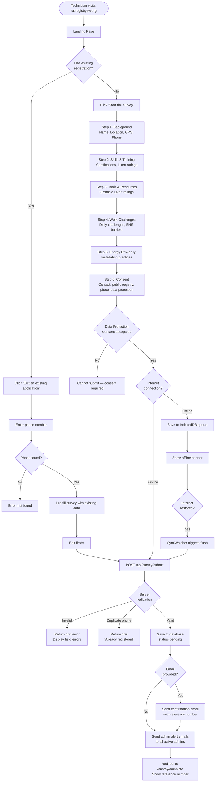
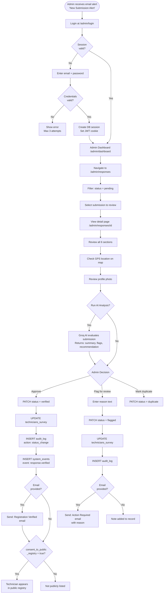
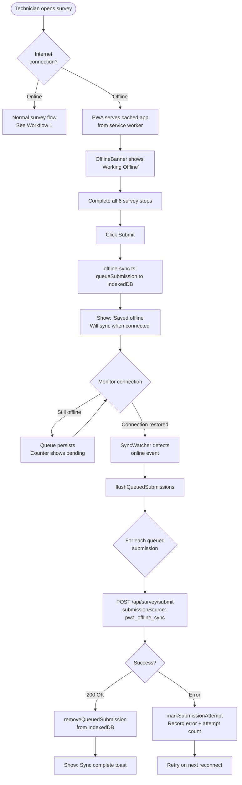
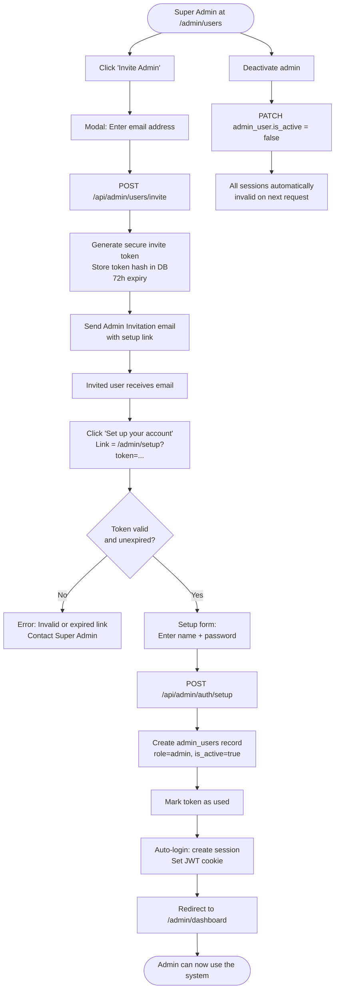
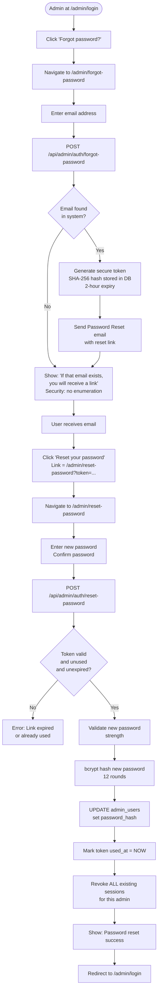
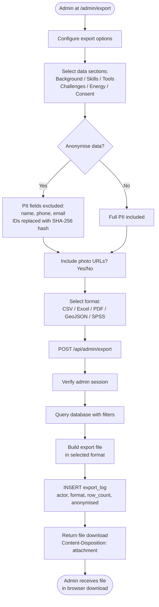
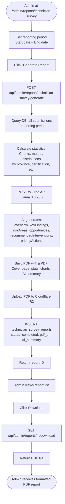
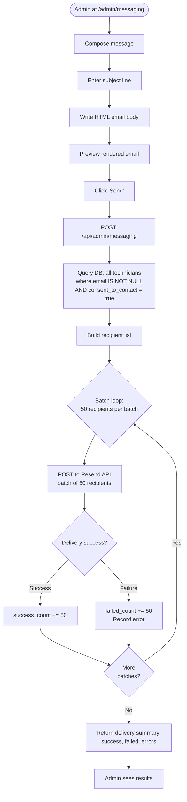
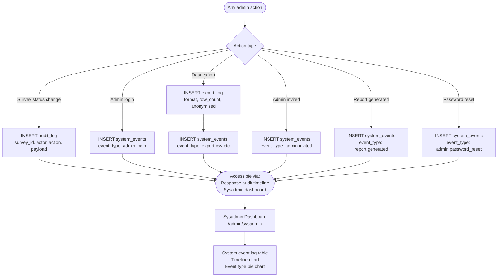
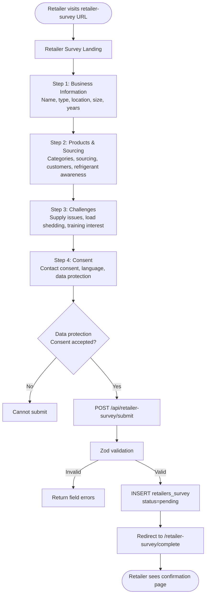

# WORKFLOW & PROCESS DIAGRAMS
## National RAC Technician Registry — ZW RAC Survey Platform

**Document Reference:** NOU-HEVACRAZ-WF-2025-001
**Version:** 1.0
**Date:** 2025-06-01
**Status:** Finalised
**Notation:** Mermaid flowchart diagrams (render at mermaid.live or in any Markdown viewer with Mermaid support)

---

## 1. TECHNICIAN REGISTRATION WORKFLOW

**Description:** End-to-end journey of a RAC technician self-registering in the national registry. Covers both online and offline paths.



---

## 2. TECHNICIAN SUBMISSION APPROVAL WORKFLOW

**Description:** The workflow an NOU/HEVACRAZ administrator follows to review and approve or flag a technician submission.



---

## 3. OFFLINE SUBMISSION WORKFLOW

**Description:** How survey submissions are queued and synchronised when the technician has no internet connection.



---

## 4. ADMIN USER MANAGEMENT WORKFLOW

**Description:** Process for onboarding new NOU/HEVACRAZ administrators and managing existing accounts.



---

## 5. PASSWORD RESET WORKFLOW

**Description:** Secure password reset flow for admin users who have forgotten their credentials.



---

## 6. DATA EXPORT WORKFLOW

**Description:** Process for exporting registry data in various formats for reporting and analysis.



---

## 7. REPORT GENERATION WORKFLOW

**Description:** Formal report generation with AI analysis and PDF output.



---

## 8. BROADCAST EMAIL WORKFLOW

**Description:** Sending mass communications to all consented technicians.



---

## 9. AI SUBMISSION ANALYSIS WORKFLOW

**Description:** On-demand AI analysis of an individual technician submission.

```mermaid
flowchart TD
    A([Admin views response detail]) --> B[Click 'AI Analysis' button]
    B --> C[POST /api/admin/ai-analyze\nbody: { surveyId }]
    C --> D[Fetch full submission\nfrom database]
    D --> E[Format survey data as JSON]
    E --> F[POST to Groq API\nLlama 3.3 70B model]
    F --> G[AI evaluates:\n- Profile summary\n- Red flags\n- Recommendation]
    G --> H{Parse JSON\nresponse}
    H -->|Success| I[Return:\n{ summary, flags, recommendation }]
    H -->|Parse error| J[Return fallback:\n'Manual review required']
    I --> K[Display in AiInsightPanel:\n- Summary text\n- Flag list\n- Recommendation badge]
```

---

## 10. SYSTEM EVENT LOGGING WORKFLOW

**Description:** How system events are recorded for audit and monitoring.



---

## 11. RETAILER SURVEY WORKFLOW

**Description:** End-to-end registration process for RAC equipment retailers and distributors.



---

*Document End*
